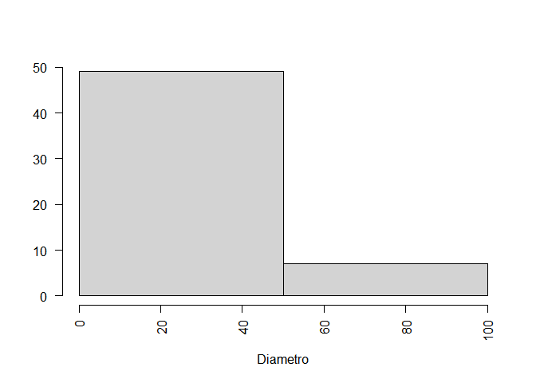
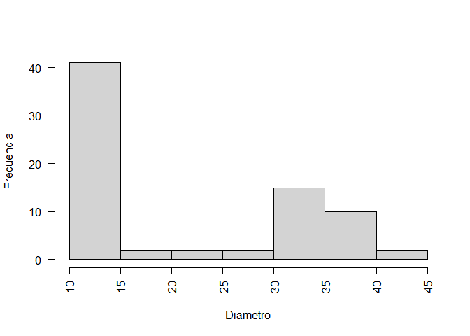

Estructura del bosque
================
David Triviño

Este ejercicio hace aprte de la clase de ecología forestal II del primer
semestre del 2016.

### Parcelas

Se analizó la estructura de 3 parcelas, cuya información recolectada era
Diametro (DC), Altura total (H), altura comercial (Hcom), diemtro de
copa (DC).

``` r
p16<-read.csv2("parcela16.csv")
p17<-read.csv2("parcela17.csv")
p18<-read.csv2("parcela18.csv")
head(p16)
```

    ##   Numarb                           Especie  X   D Hcom  H DC
    ## 1      1                  Zygia latifolium NA  17    7 11  5
    ## 2      2                      Drypetes sp. NA  11    6  8  4
    ## 3      3             Eschweilera juruensis NA  50   20 27 11
    ## 4      4 Sorocea hirtella ssp. oligotricha NA  13    9 11  4
    ## 5      5      Aspidosperma cf. multiflorum NA  23   10 13  5
    ## 6      6                  Annona cf.glabra NA 100   13 21 12

### Alturas de copa

``` r
p16$HC<-p16$H-p16$Hcom
p17$HC<-p17$H-p17$Hcom
p18$HC<-p18$H-p18$Hcom
```

### Estructura diamétrica

``` r
with(p16, plot(D, H, xlab="Diametro (cm)", ylab="Altura (m)", pch=0))
```

<!-- -->

``` r
with(p17, plot(D, H, xlab="Diametro (cm)", ylab="Altura (m)", pch=1))
```

<!-- -->

``` r
with(p18, plot(D, H, xlab="Diametro (cm)", ylab="Altura (m)", pch=2))
```

<!-- -->

### Función estimar n de Liocur-Meyer III N=k\*exp(-rD^n)

``` r
estimar.n<-function(N, D,datos,x,y,z){
        n=seq(x,y,z)
        CME<-function(mod){
                cme= CME=anova(mod)$Mean[length(anova(mod)$Mean)]
        }
        cme=vector()
        for(i in 1:length(n)){
                mod<-lm(log(N)~I(D^n[i]),datos)
                cme[i]=CME(mod)
        } 
        plot(n,cme,type="l", xlab="m",ylab="CME del modelo lineal")
        
        data=data.frame(cme,n)
        print(data[which.min(data$cme),])
        
}
```

### Distribución diamétrica de cada parcela

``` r
h16<-with(p16, hist(D, xlab="Diametro",ylab="",breaks = 2, main="", las=2))
```

<!-- -->

``` r
tab16<-data.frame(h16$counts,h16$mids)
t16<-tab16[-c(6:8),]
colnames(t16)<-c("N","xi")
```

``` r
h17<-with(p17, hist(D, xlab="Diametro",ylab="Frecuencia", main="", las=2))
```

<!-- -->

``` r
tab17<-data.frame(h17$counts,h17$mids)
t17<-tab17[-c(3,5),]
colnames(t17)<-c("N","xi")
```

``` r
h18<-with(p18, hist(D, xlab="Diametro",ylab="Frecuencia", main="", las=2))
```

<!-- -->

``` r
t18<-data.frame(h18$counts,h18$mids)
colnames(t18)<-c("N","xi")
```

## Modelaminto de las clases diemétricas

### Parcela 16

``` r
mod16<-lm(log(N)~I(xi^2),t16)
mod16<-lm(log(N)~I(xi^-2.318), t16) #mejor modelo
mod16<-lm(log(N)~xi, t16)
```

``` r
summary(mod16)
```

    ## 
    ## Call:
    ## lm(formula = log(N) ~ xi, data = t16)
    ## 
    ## Residuals:
    ## ALL 2 residuals are 0: no residual degrees of freedom!
    ## 
    ## Coefficients:
    ##             Estimate Std. Error t value Pr(>|t|)
    ## (Intercept)  4.86478         NA      NA       NA
    ## xi          -0.03892         NA      NA       NA
    ## 
    ## Residual standard error: NaN on 0 degrees of freedom
    ## Multiple R-squared:      1,  Adjusted R-squared:    NaN 
    ## F-statistic:   NaN on 1 and 0 DF,  p-value: NA

#### Gráfica del modelo y las distribuciones

``` r
h16<-with(p16, hist(D, xlab="Diametro",ylab="", main="", las=2, xlim=c(10,100)))
par(new=TRUE)
curve(exp(0.8785+(0.2221/2))*exp((127.2*x^-2.318)),from=10,to=100,xlim=c(10,100), axes=F, col="Red", ylab="",xlab="")
```

<!-- -->

### Parcela 17

``` r
with(t17, estimar.n(N, xi,t17,10.0,10.3,0.001))
```

<!-- -->

    ##          cme      n
    ## 99 0.1096721 10.098

``` r
mod17<-lm(log(N)~I(xi^2),t17)
mod17<-lm(log(N)~I(xi^10.098), t17) #Mejor modelo
mod17<-lm(log(N)~xi, t17)
```

``` r
summary(mod17)
```

    ## 
    ## Call:
    ## lm(formula = log(N) ~ xi, data = t17)
    ## 
    ## Residuals:
    ##       1       2       4       6 
    ## -0.3563  0.4232  0.0444 -0.1113 
    ## 
    ## Coefficients:
    ##             Estimate Std. Error t value Pr(>|t|)  
    ## (Intercept)   7.6571     2.3795   3.218   0.0845 .
    ## xi           -0.5375     0.2084  -2.578   0.1232  
    ## ---
    ## Signif. codes:  0 '***' 0.001 '**' 0.01 '*' 0.05 '.' 0.1 ' ' 1
    ## 
    ## Residual standard error: 0.4003 on 2 degrees of freedom
    ## Multiple R-squared:  0.7687, Adjusted R-squared:  0.6531 
    ## F-statistic: 6.648 on 1 and 2 DF,  p-value: 0.1232

``` r
{
  h17<-with(p17, hist(D, xlab="Diametro",ylab="Frecuencia", main="", las=2))
  par(new=T)
  curve(exp(2.209e+00+(0.10967/2))*exp((-1.053e-11*x^10.098)),from=10,to=13, 
        axes=F, col="Red", ylab="",xlab="")
}
```

<!-- -->

### Parcela 18

``` r
with(t18, estimar.n(N, xi,t18,-280,-100,1))
```

<!-- -->

    ##         cme    n
    ## 2 0.8921633 -279

``` r
mod18<-lm(log(N)~I(xi^2),t18)
mod18<-lm(log(N)~I(xi^-100), t18)
mod18<-lm(log(N)~xi, t18)
```

``` r
summary(mod18)
```

    ## 
    ## Call:
    ## lm(formula = log(N) ~ xi, data = t18)
    ## 
    ## Residuals:
    ##       1       2       3       4       5       6       7 
    ##  1.6611 -1.2226 -1.0859 -0.9493  1.2023  0.9336 -0.5392 
    ## 
    ## Coefficients:
    ##             Estimate Std. Error t value Pr(>|t|)
    ## (Intercept)  2.39423    1.47908   1.619    0.166
    ## xi          -0.02734    0.05055  -0.541    0.612
    ## 
    ## Residual standard error: 1.337 on 5 degrees of freedom
    ## Multiple R-squared:  0.05527,    Adjusted R-squared:  -0.1337 
    ## F-statistic: 0.2925 on 1 and 5 DF,  p-value: 0.6118

Teniendo en cuenta que ningun modelo se le ajusto, se opta por partir la
base de datos en dos.

``` r
t18a<-t18[c(1:4),]
t18b<-t18[c(5:7),]
t18c<-t18[c(4:7),]
```

``` r
with(t18a, estimar.n(N, xi,t18a,-10,1,1))
```

<!-- -->

    ##           cme   n
    ## 1 0.003403433 -10

``` r
mod18a<-lm(log(N)~I(xi^2),t18a)
mod18a<-lm(log(N)~I(xi^-8), t18a)  #Mejor ajuste R2
mod18a<-lm(log(N)~xi, t18a)

summary(mod18a)
```

    ## 
    ## Call:
    ## lm(formula = log(N) ~ xi, data = t18a)
    ## 
    ## Residuals:
    ##       1       2       3       4 
    ##  0.9061 -1.2082 -0.3020  0.6041 
    ## 
    ## Coefficients:
    ##             Estimate Std. Error t value Pr(>|t|)
    ## (Intercept)   5.0728     2.1728   2.335    0.145
    ## xi           -0.1812     0.1046  -1.732    0.225
    ## 
    ## Residual standard error: 1.17 on 2 degrees of freedom
    ## Multiple R-squared:    0.6,  Adjusted R-squared:    0.4 
    ## F-statistic:     3 on 1 and 2 DF,  p-value: 0.2254

``` r
with(t18b, estimar.n(N, xi,t18b,11,12,0.01))
```

<!-- -->

    ##             cme     n
    ## 48 2.014557e-08 11.47

``` r
mod18b<-lm(log(N)~I(xi^2),t18b)
mod18b<-lm(log(N)~I(xi^11.47), t18b) #Mejor modelo
mod18b<-lm(log(N)~xi, t18b)

summary(mod18b)
```

    ## 
    ## Call:
    ## lm(formula = log(N) ~ xi, data = t18b)
    ## 
    ## Residuals:
    ##       5       6       7 
    ## -0.2007  0.4013 -0.2007 
    ## 
    ## Coefficients:
    ##             Estimate Std. Error t value Pr(>|t|)
    ## (Intercept)  9.45715    2.62208   3.607    0.172
    ## xi          -0.20149    0.06951  -2.899    0.211
    ## 
    ## Residual standard error: 0.4915 on 1 degrees of freedom
    ## Multiple R-squared:  0.8936, Adjusted R-squared:  0.7873 
    ## F-statistic: 8.402 on 1 and 1 DF,  p-value: 0.2115

``` r
mod18c<-lm(log(N)~log(xi)+xi, t18c)

summary(mod18c)
```

    ## 
    ## Call:
    ## lm(formula = log(N) ~ log(xi) + xi, data = t18c)
    ## 
    ## Residuals:
    ##        4        5        6        7 
    ## -0.02968  0.09899 -0.10894  0.03963 
    ## 
    ## Coefficients:
    ##              Estimate Std. Error t value Pr(>|t|)  
    ## (Intercept) -218.0351    18.7113  -11.65   0.0545 .
    ## log(xi)       86.9937     7.3991   11.76   0.0540 .
    ## xi            -2.5293     0.2149  -11.77   0.0540 .
    ## ---
    ## Signif. codes:  0 '***' 0.001 '**' 0.01 '*' 0.05 '.' 0.1 ' ' 1
    ## 
    ## Residual standard error: 0.1553 on 1 degrees of freedom
    ## Multiple R-squared:  0.9928, Adjusted R-squared:  0.9785 
    ## F-statistic: 69.29 on 2 and 1 DF,  p-value: 0.08464

#### Grafica de la paracela 18

``` r
{
  h18<-with(p18, hist(D, xlab="Diametro",ylab="Frecuencia", main="",
        las=2,xlim=c(10,45),ylim=c(0,40)))
  par(new=T)
  curve(exp(6.149e-01+(0.0125/2))*exp(1.842e+09*x^-8),from=10,to=30,xlim=c(10,45),ylim=c(0,40),
        axes=F, col="Red", ylab="",xlab="")
  par(new=T)
  curve(exp(-218.0351+(0.0241/2))*exp(-2.5293*x)*x^86.9937, from=20, to=45, xlim=c(10,45),
        ylim=c(0,40), axes=F, ylab="",xlab="",col="blue")
}
```

<!-- -->

## Clases altimetricas

``` r
a16<-with(p16, hist(H, xlab="Altura",ylab="Frecuencia", main="", las=2))
```

<!-- -->

``` r
tab16<-data.frame(a16$counts,a16$mids)
colnames(tab16)<-c("N","h")
with(tab16, sum(N))
```

    ## [1] 56

``` r
tab16$Por<-100*tab16$N/56
tab16
```

    ##    N    h       Por
    ## 1 19  7.5 33.928571
    ## 2 18 12.5 32.142857
    ## 3 10 17.5 17.857143
    ## 4  4 22.5  7.142857
    ## 5  5 27.5  8.928571

``` r
a17<-with(p17, hist(H, xlab="Altura",ylab="Frecuencia", main="", las=2))
```

<!-- -->

``` r
tab17<-with(a17, data.frame(counts,mids))
tab17<-tab17[-c(5,6),]
colnames(tab17)<-c("N","h")
with(tab17, sum(N))
```

    ## [1] 22

``` r
tab17$Por<-100*tab17$N/22
tab17
```

    ##    N    h       Por
    ## 1  6  4.5 27.272727
    ## 2 10  5.5 45.454545
    ## 3  3  6.5 13.636364
    ## 4  2  7.5  9.090909
    ## 7  1 10.5  4.545455

``` r
a18<-with(p18, hist(H, xlab="Altura",ylab="Frecuencia", main="", las=2))
```

<!-- -->

``` r
tab18<-with(a18, data.frame(counts,mids))
colnames(tab18)<-c("N","h")
with(tab18, sum(N))
```

    ## [1] 74

``` r
tab18$Por<-100*tab18$N/74
tab18
```

    ##     N  h       Por
    ## 1   4  3  5.405405
    ## 2   4  5  5.405405
    ## 3  18  7 24.324324
    ## 4  14  9 18.918919
    ## 5   4 11  5.405405
    ## 6   3 13  4.054054
    ## 7   4 15  5.405405
    ## 8   3 17  4.054054
    ## 9  12 19 16.216216
    ## 10  5 21  6.756757
    ## 11  3 23  4.054054

``` r
t16$por<-100*t16$N/sum(t16$N)
t16           
```

    ##    N xi  por
    ## 1 49 25 87.5
    ## 2  7 75 12.5

``` r
t17$por<-100*t17$N/sum(t17$N)
t17
```

    ##    N    xi       por
    ## 1  6 10.25 27.272727
    ## 2 10 10.75 45.454545
    ## 4  4 11.75 18.181818
    ## 6  2 12.75  9.090909

``` r
t18$por<-100*t18$N/sum(t18$N)
t18
```

    ##    N   xi       por
    ## 1 41 12.5 55.405405
    ## 2  2 17.5  2.702703
    ## 3  2 22.5  2.702703
    ## 4  2 27.5  2.702703
    ## 5 15 32.5 20.270270
    ## 6 10 37.5 13.513514
    ## 7  2 42.5  2.702703

## Modelamiento de las claes altimétricas

### Parcela 16

``` r
with(tab16, estimar.n(N, h,tab16,0.9,1.0,0.001))
```

<!-- -->

    ##          cme     n
    ## 80 0.1021103 0.979

``` r
m16<-lm(log(N)~I(h^2),tab16)
m16<-lm(log(N)~I(h^0.979), tab16) #mejor modelo
m16<-lm(log(N)~h, tab16)

summary(m16)
```

    ## 
    ## Call:
    ## lm(formula = log(N) ~ h, data = tab16)
    ## 
    ## Residuals:
    ##        1        2        3        4        5 
    ## -0.11700  0.24634  0.07596 -0.42292  0.21763 
    ## 
    ## Coefficients:
    ##             Estimate Std. Error t value Pr(>|t|)   
    ## (Intercept)  3.68755    0.38148   9.667  0.00235 **
    ## h           -0.08348    0.02021  -4.130  0.02574 * 
    ## ---
    ## Signif. codes:  0 '***' 0.001 '**' 0.01 '*' 0.05 '.' 0.1 ' ' 1
    ## 
    ## Residual standard error: 0.3196 on 3 degrees of freedom
    ## Multiple R-squared:  0.8505, Adjusted R-squared:  0.8006 
    ## F-statistic: 17.06 on 1 and 3 DF,  p-value: 0.02574

#### Grafica del modelo y las distribuciones

``` r
{
  a16<-with(p16, hist(H, xlab="Altura",ylab="Frecuencia", main="", las=2, xlim=c(5,30)))
  par(new=TRUE)
  curve(exp(3.71461+(0.10211/2))*exp((-0.09046*x^0.979)),from=5,to=30,xlim=c(5,30), axes=F,
        col="Red", ylab="",xlab="")
}
```

<!-- -->

### Parcela 17

``` r
with(tab17, estimar.n(N, h,tab17,0.6,0.7,0.001))
```

<!-- -->

    ##          cme     n
    ## 67 0.1922264 0.666

``` r
m17<-lm(log(N)~I(h^2),tab17)
m17<-lm(log(N)~I(h^0.666), tab17) #mejor modelo
m17<-lm(log(N)~h, tab17)

summary(m17)
```

    ## 
    ## Call:
    ## lm(formula = log(N) ~ h, data = tab17)
    ## 
    ## Residuals:
    ##       1       2       3       4       7 
    ## -0.2399  0.6270 -0.2210 -0.2705  0.1044 
    ## 
    ## Coefficients:
    ##             Estimate Std. Error t value Pr(>|t|)  
    ## (Intercept)  3.63369    0.68972   5.268   0.0133 *
    ## h           -0.35601    0.09578  -3.717   0.0339 *
    ## ---
    ## Signif. codes:  0 '***' 0.001 '**' 0.01 '*' 0.05 '.' 0.1 ' ' 1
    ## 
    ## Residual standard error: 0.441 on 3 degrees of freedom
    ## Multiple R-squared:  0.8216, Adjusted R-squared:  0.7621 
    ## F-statistic: 13.81 on 1 and 3 DF,  p-value: 0.03388

### Gráfica del modelo y las distribuciones

``` r
{
  a17<-with(p17, hist(H, xlab="Altura",ylab="Frecuencia", main="", las=2,  xlim=c(4,11)))
  par(new=TRUE)
  curve(exp(4.9124+(0.19223/2))*exp((-1.0417*x^0.666)),from=4,to=11,xlim=c(4,11), axes=F,
        col="Red", ylab="",xlab="")
}
```

<!-- -->

### Parcela 18

``` r
a18<-with(p18, hist(H, xlab="Altura",ylab="Frecuencia", main="", las=2, xlim=c(2,24)))
```

<!-- -->

``` r
with(tab18, estimar.n(N, h,tab18,-10,100,1))
```

<!-- -->

    ##         cme n
    ## 11 0.439671 0

``` r
m18<-lm(log(N)~I(h^2),tab18)
m18<-lm(log(N)~I(h^0), tab18) #mejor modelo
m18<-lm(log(N)~h, tab18)

summary(mod18)
```

    ## 
    ## Call:
    ## lm(formula = log(N) ~ xi, data = t18)
    ## 
    ## Residuals:
    ##       1       2       3       4       5       6       7 
    ##  1.6611 -1.2226 -1.0859 -0.9493  1.2023  0.9336 -0.5392 
    ## 
    ## Coefficients:
    ##             Estimate Std. Error t value Pr(>|t|)
    ## (Intercept)  2.39423    1.47908   1.619    0.166
    ## xi          -0.02734    0.05055  -0.541    0.612
    ## 
    ## Residual standard error: 1.337 on 5 degrees of freedom
    ## Multiple R-squared:  0.05527,    Adjusted R-squared:  -0.1337 
    ## F-statistic: 0.2925 on 1 and 5 DF,  p-value: 0.6118

## Clases Diamétricas

``` r
{
          par(mfrow=c(1,3))
          h16<-with(p16, hist(D, xlab="Diametro",ylab="", main="", las=2, xlim=c(10,100)))
          par(new=TRUE)
          curve(exp(0.8785+(0.2221/2))*exp((127.2*x^-2.318)),from=10,to=100,
                xlim=c(10,100), axes=F, col="Red", ylab="",xlab="")
          h17<-with(p17, hist(D, xlab="Diametro",ylab="Frecuencia", main="", las=2))
          par(new=T)
          curve(exp(2.209e+00+(0.10967/2))*exp((-1.053e-11*x^10.098)),from=10,
                to=13, axes=F, col="Red", ylab="",xlab="")
          h18<-with(p18, hist(D, xlab="Diametro",ylab="Frecuencia", main="", 
                              las=2, xlim=c(10,45)))
          par(new=T)
          curve(exp(6.149e-01+(0.0125/2))*exp(1.842e+09*x^-8),from=10,to=30,
                xlim=c(10,45),ylim=c(0,40), axes=F, col="Red", ylab="",xlab="")
          par(new=T)
          curve(exp(-218.0351+(0.0241/2))*exp(-2.5293*x)*x^86.9937, from=20, to=45, 
                xlim=c(10,45), ylim=c(0,40), axes=F, ylab="",xlab="",col="blue")
}
```

<!-- -->

## Clases altimétricas

``` r
{
        par(mfrow=c(1,3))
        a16<-with(p16, hist(H, xlab="Altura",ylab="Frecuencia", main="", las=2, xlim=c(5,30)))
        a17<-with(p17, hist(H, xlab="Altura",ylab="Frecuencia", main="", las=2,  xlim=c(4,11)))
        a18<-with(p18, hist(H, xlab="Altura",ylab="Frecuencia", main="", las=2, xlim=c(2,24)))
}
```

<!-- -->
